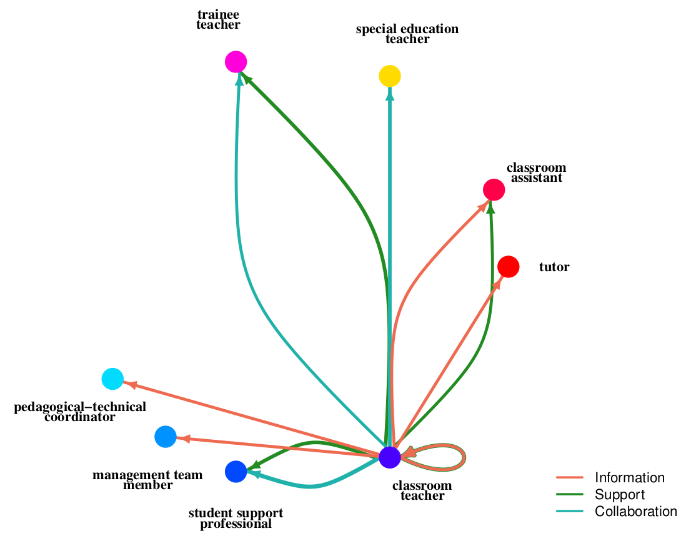

# Making Sense Chile

The code available in this repository is part of the project *Making Sense Chile*.

Part of ours results will appear in the book chapter *Tensions, resistance and collectivism in Chilean teacher agency for social justice*.

## Authors
- Constanza Herresa Seda, Universidad de Santiago
- Constanza Cárdenas Alarcón, Universidad de Santiago
- Jaime Retamal Salazar, Universidad de Santiago
- Esteban Vicencio Callejas, Universidad de Santiago
- José Fuentes Sepúlveda, Universidad de Concepción

 

## Code usage

`python3 get_graph.py <CSV file with interview logs> <CSV file with school roles> <Output folder>`

The previous code will generate two CSV files per school. For instance, for the school ABC, the program `get_graph.py` will generate the files `red_edges_ABC.csv` and `nodes_ABC.csv`. The first resulting file will store the relationships among the different roles in the school ABC, while the second file will store the role names. Combined, both files represent the interaction network of the school ABC.

 

Finally, the output files the `get_graph.py` will be the input of `plot_graph.r`, a R code to plot the interaction network.

`Rscript plot_graph.r <CSV file with relationships> <CSV file with role names> <Output PDF file> <Number of teachers>`

For instance, for the school ABC, assuming that it has 20 teachers, the plot of its interaction network will be generated with the following command (the resulting network will be stored in `network_ABD.pdf`:

`Rscript plot_graph.r red_edges_ABC.csv red_nodes_ABC.csv network_ABC.pdf 20`

 
The next image shows an example of a resulting interaction network:
 

